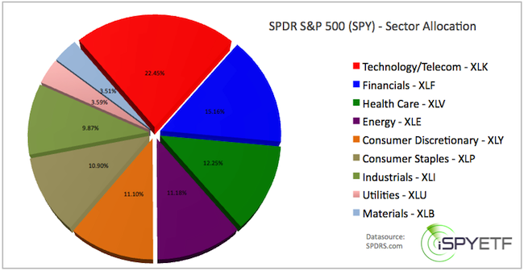
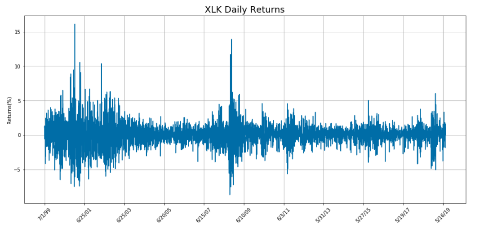
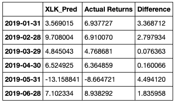
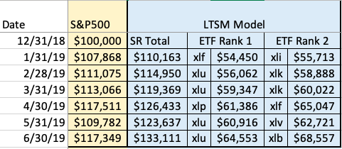

# How to Make More Money Than The Average Bear
## The Question:
Can machine learning or a known trading algorithm imporve upon the performance of the S&P 500 by only investing in a small subset of the sectors that comprise this benchmark equity index?
## The Data 
- Stock data from Yahoo Finance on the S&P 500 and 9 sectors 
- Data ranging from July 1, 1999 to July 1, 2019
- **Sectors Include:** 
  - XLB: Materials
  - XLE: Energy 
  - XLF: Finacials 
  - XLI: Industrials 
  - XLK: Tech
  - XLP: Consumer Staples 
  - XLV: Health Care
  - XLY: Consumer Discretionary 
  - XLU: Utilities 
  
  **An approximate breakdown of sector allocation**
 
## Sector Rotation and Rebalncing
 - Sector rotation is an investment strategy that involves moving money from one industry sector to another. In this case based on a weighted score from our trading algorithm or the best predicted monthly return based on our LSTM model.
- Rebalancing involves investing the same amount of money in a number of sectors and then selling the ETFs at the end of each month and using the capital to buy equal amounts in each of the sectors.  
## LSTM Model 
- An LSTM (Long Short Term Memory) Model is a type of recurrent neural network capable of learning order dependence in sequence prediction problems 
- Training Data: Daily Returns 7/1/1999 - 12/31/2018
- Testing Data: Daily Returns 1/2/2019 - 7/1/2019

Instead of using closing price or adjusted closing price I decided to calculate the **daily returns** for each day instead. Where a lot of people fall short when trying to use machine learning on stock data is they try to predict what the price is going to be. Not only will this most likely garner extremely inaccurate results but it’s also kind of pointless in a lot of ways. Nobody really cares what the exact price of Amazon is going to be next week, what we care about is whether the stock is going to go up or down. Just being able to predict the correct direction of a stock with some accuracy would be incredibly valuable. This also makes things like window size less important because you down have to account for huge price changes over the 20 year period. 

Below are the actual returns for the 6 month period of test data vesus the predictions made by the LSTM model for the technology sector (XLK). As you can see the model fails to capture the everyday volatility of the stock market but seems to be able to follow the overall trend with some accuracy. 

The daily returns are then aggregated into monthly returns on the last trading day of the month. As you can see the predictions are still off, but only by a small margin in some instances. Most importanly the LSTM model was able to capture the correct direction of the stock in all cases for XLK. This is true for almost all monthly predictions made across all 9 sectors. 

## Backtesting Results:
The backtesting section of this project is still under construction, however I have provided my results in an Excel spreadsheet. The final figure resulting from a $100,000 investment ranging from January 2, 2019 to June 28, 2019 for each of the following strategies:
  - Investment in a S&P 500 ETF
  - Investment in top 2 sectors determined by LSTM model 

